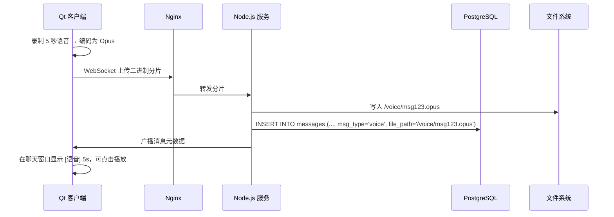
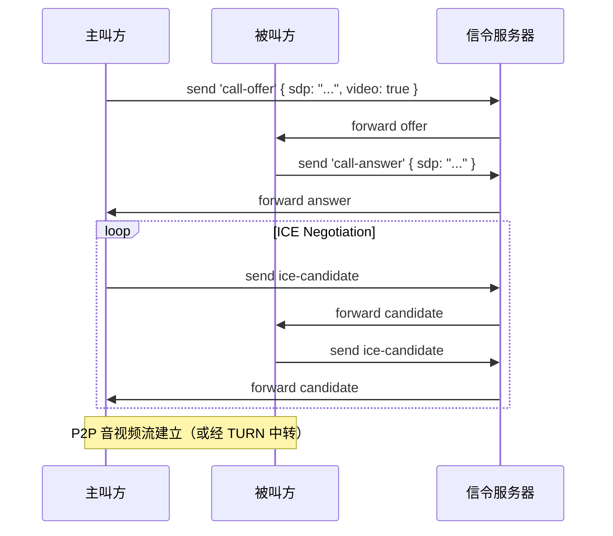

# 跨平台聊天软件项目概述

## 1. 项目目标

本项目旨在开发一款轻量、安全、高效的跨平台即时通讯（IM）软件，支持 Windows、macOS 和 Linux 等主流桌面操作系统。通过采用 Qt 框架与 CMake 构建系统，实现代码一次编写、多平台部署，为用户提供一致的用户体验和可靠的通信功能。

## 2. 技术选型

- **核心语言**：C++（标准 C++17 或更高）
- **GUI 框架**：Qt 6（利用其跨平台能力、丰富的 UI 组件及网络模块）
- **构建系统**：CMake（提供灵活、可维护的跨平台构建配置）
- **通信协议**：
    - 客户端-服务器通信：WebSocket + JSON（或 Protocol Buffers）
    - 可选支持：TLS/SSL 加密传输
- **依赖管理**：CMake 的 FetchContent 或 vcpkg/conan（用于第三方库集成）
- **可选扩展库**：
    - OpenSSL（加密）
    - SQLite（本地消息缓存）
    - libnice / WebRTC（未来语音/视频通话支持）

## 3. 核心功能模块

### 3.1 用户系统

- 用户注册与登录（支持邮箱/用户名+密码）
- 用户状态管理（在线、离线、忙碌等）
- 好友列表与联系人管理

### 3.2 即时通讯

- 一对一文本消息收发
- 消息历史记录（本地存储与同步）
- 已读/未读状态提示
- 消息时间戳与发送状态反馈

### 3.3 网络通信

- 基于 WebSocket 的长连接机制
- 心跳保活与自动重连
- 断线恢复与消息补发

### 3.4 用户界面

- 现代化、响应式 UI 设计（使用 Qt Quick 或 QWidget）
- 多语言支持（Qt 国际化机制）
- 主题切换（浅色/深色模式）

### 3.5 安全与隐私

- 通信数据端到端加密（可选）
- 本地数据库加密存储
- 登录凭证安全处理（哈希+盐值）

## 4. 项目架构设计

- **分层架构**：
    
    - 表现层（UI）：Qt Widgets / QML
    - 业务逻辑层：C++ 核心类（消息管理、用户管理等）
    - 网络层：封装 WebSocket 客户端与协议解析
    - 数据层：本地缓存（SQLite）、配置文件（QSettings）
- **模块化设计**：
    
    - 各功能模块解耦，便于测试与维护
    - 使用信号槽机制实现组件间通信

## 5. 跨平台支持策略

- 利用 Qt 的抽象层屏蔽平台差异
- CMake 配置文件统一管理编译选项与依赖
- 平台特定代码通过宏或条件编译隔离
- 自动化 CI/CD 流程覆盖三大平台构建与测试

## 6. 开发与部署计划

- **阶段一**：基础框架搭建（CMake + Qt 项目结构、登录界面）
- **阶段二**：核心通信功能实现（WebSocket 连接、消息收发）
- **阶段三**：UI 优化与本地数据持久化
- **阶段四**：安全增强与性能调优
- **阶段五**：多平台打包与发布（Windows MSI、macOS dmg、Linux AppImage）

## 7. 预期成果

- 一个可运行的跨平台桌面聊天客户端
- 清晰的代码结构与文档
- 支持持续集成的 CMake 构建系统
- 为后续扩展（群聊、文件传输、音视频）预留接口

---

本项目将充分发挥 Qt 与 CMake 在跨平台开发中的优势，打造一个结构清晰、易于维护且具备良好扩展性的现代聊天应用基础框架。
# 架构设计

基于需求（**跨平台 Qt 聊天客户端 + 公网可用 + 支持文本、文件、语音消息、未来语音/视频通话**）设计一套**完整、可演进、生产就绪的系统架构**。以下从 **整体分层、模块职责、数据流、协议选择、部署拓扑** 五个维度详细说明。

---

## 🏗️ 一、整体架构图（分层设计）

```
+--------------------------------------------------+
|                Qt 客户端（C++/Qt6）               |
|  ┌─────────────┐    ┌───────────────────────┐   |
|  │  UI Layer   │◄──►│     Business Logic    │   |
|  └─────────────┘    └───────────────────────┘   |
|        ▲                      │                  |
|        │                      ▼                  |
|        │         ┌─────────────────────────┐    |
|        └─────────┤   Network Abstraction   │    |
|                  └─────────────────────────┘    |
|                          │           │          |
|        (异步通信)         │           │ (实时通信)|
|                          ▼           ▼          |
|                 QWebSocket      WebRTC Native   |
+--------------------------------------------------+
            │                        │
            │ WSS (TCP/TLS)          │ SRTP/UDP + 信令
            ▼                        ▼
+--------------------------------------------------+
|                云服务器（Linux）                 |
|                                                  |
|  ┌─────────────┐    ┌───────────────────────┐   |
|  │  Nginx      │◄──►│   Node.js 信令服务     │   |
|  │ (SSL Termination│  (Socket.IO + REST API) │   |
|  │  + File CDN)│    └───────────────────────┘   |
|  └─────────────┘              ▲        ▲        |
|        ▲                      │        │        |
|        │ 静态文件              │        │ STUN/TURN
|        └──────────────────────┘        │        |
|                                       ▼        |
|                               ┌─────────────────┐
|                               │   coturn        │
|                               │ (TURN Server)   │
|                               └─────────────────┘
|                                       ▲
|                                       │
|                               ┌─────────────────┐
|                               │ PostgreSQL      │
|                               │ (用户/消息元数据)│
|                               └─────────────────┘
|                               ┌─────────────────┐
|                               │ /var/www/files  │
|                               │ (语音/文件存储) │
|                               └─────────────────┘
+--------------------------------------------------+
```

---

## 🔧 二、模块职责详解

### 1. **Qt 客户端（跨平台：Windows/macOS/Linux/Android/iOS）**

#### (1) UI Layer

- 使用 `QListView` + 自定义 `Delegate` 显示会话列表
- 聊天窗口：`QTextEdit`（文本）、`QMediaPlayer`（语音消息）、`QVideoWidget`（视频预览）
- 通话界面：全屏/悬浮窗，含摄像头开关、静音、挂断按钮

#### (2) Business Logic

- **会话管理器**：维护 `chat_id ↔ ChatWindow` 映射
- **消息处理器**：
    - 文本/文件/语音消息 → 通过 WebSocket 发送
    - 通话请求 → 触发 WebRTC 模块
- **本地数据库**：SQLite 缓存消息历史（提升启动速度）

#### (3) Network Abstraction（关键抽象层）

```cpp
class NetworkService {
public:
    // 异步通信（文本/文件/语音消息）
    void sendMessage(const Message& msg);
    void uploadFile(const QString& path);

    // 实时通信（音视频）
    void startCall(const QString& peerId, bool video = false);
    void endCall();

signals:
    void messageReceived(const Message&);
    void callIncoming(const QString& callerId, bool video);
};
```

#### (4) 通信实现

- **QWebSocket**：连接 `wss://yourdomain.com/ws`，处理所有非实时数据
- **WebRTC Native**：封装 Google WebRTC C++ 库，负责音视频采集、编码、P2P 传输

---

### 2. **云服务器（单台 Linux ECS 即可）**

#### (1) Nginx

- **SSL 终止**：将 `wss://` 和 `https://` 解密为内部 `ws://` 和 `http://`
- **静态文件服务**：提供 `/files/xxx.opus` 下载（语音消息、图片缩略图等）
- **反向代理**：
    
    ```nginx
    location /ws {
        proxy_pass http://localhost:3000;
        proxy_http_version 1.1;
        proxy_set_header Upgrade $http_upgrade;
        proxy_set_header Connection "upgrade";
    }
    ```
    

#### (2) Node.js 信令服务（核心）

- 基于 **Socket.IO**，提供两类通道：
    - **聊天通道**：文本、文件元数据、语音消息通知
    - **信令通道**：WebRTC 的 SDP offer/answer、ICE candidates
- 提供 REST API 用于登录、获取好友列表等
- 连接 PostgreSQL 存储结构化数据

#### (3) PostgreSQL

- 存储：
    - 用户账号（`users`）
    - 会话关系（`chats`, `chat_members`）
    - 消息元数据（`messages`，不含大文件内容）
    - 文件/语音引用（`file_path` 字段）

#### (4) 文件存储

- 所有上传的文件（包括语音消息 `.opus`）保存在：
    
    ```
    /var/www/chat-files/
      ├── images/
      ├── voice/
      └── documents/
    ```
    
- **不存入数据库**，仅存路径和元信息（大小、MIME 类型）

#### (5) coturn（TURN 服务器）

- 当 P2P 打洞失败时（如双方都在对称 NAT 后），中转音视频流量
- 配置认证防止滥用（用户名/密码由信令服务器动态生成）

---

## 📡 三、关键数据流示例

### 场景 1：发送一条语音消息



### 场景 2：发起视频通话



---

## 📡 四、协议与技术选型总结

|功能|协议|技术栈|说明|
|---|---|---|---|
|**文本/文件/语音消息**|WSS (WebSocket Secure)|Qt `QWebSocket` + Node.js Socket.IO|可靠传输，复用现有通道|
|**语音/视频通话**|WebRTC (SRTP/SCTP over UDP)|WebRTC Native + coturn|实时低延迟，支持 P2P|
|**信令交换**|WebSocket|Socket.IO|复用聊天通道，无需新端口|
|**文件下载**|HTTPS|Nginx static serve|高并发、缓存友好|
|**身份认证**|JWT + Bearer Token|Node.js + bcrypt|登录后获取 token，用于 WebSocket 认证|

---

## 🖥️ 五、部署与运维建议

### 服务器配置（最低要求）

- **CPU**: 2 核（WebRTC 转码较耗 CPU）
- **内存**: 4 GB
- **带宽**: ≥ 10 Mbps（若多人同时通话）
- **系统**: Ubuntu 22.04 LTS

### 安全加固

- 防火墙只开放 80/443/3478(UDP)/5349(TCP)
- PostgreSQL 不对外开放，仅 localhost 访问
- TURN 服务器启用长期凭证机制（LTM）

### 监控与日志

- PM2 管理 Node.js 进程
- 使用 `journalctl` 查看 coturn 日志
- Nginx 访问日志分析文件下载热点

---

## 🚀 六、演进路线（MVP → 完整产品）

|版本|功能|架构变化|
|---|---|---|
|**v1.0**|文本聊天 + 好友列表|SQLite 本地 + Qt TCP 服务器（局域网）|
|**v2.0**|公网文本 + 文件传输|PostgreSQL + Node.js + WebSocket|
|**v3.0**|语音消息|复用文件通道 + Qt 音频模块|
|**v4.0**|语音/视频通话|集成 WebRTC + 部署 coturn|
|**v5.0**|群组通话、屏幕共享|WebRTC SFU 架构（如 Mediasoup）|

---

## ✅ 总结

当前的最佳路径是：

1. **先用 WebSocket + PostgreSQL 实现文本和文件传输**
2. **语音消息作为“特殊文件”快速上线**
3. **再引入 WebRTC 实现实时通话，复用现有信令通道**

这套架构：

- ✅ **完全跨平台**（Qt 客户端）
- ✅ **公网可用**（Nginx + SSL）
- ✅ **可扩展**（从单机到集群）
- ✅ **符合工业标准**（WebRTC 是实时通信唯一选择）

---

如果你需要，我可以立即提供：

- **Node.js 信令服务器完整代码模板**
- **Qt 客户端 WebSocket 封装类**
- **PostgreSQL 初始化 SQL 脚本**
- **coturn 配置指南**

请告诉我你希望优先获取哪一部分！